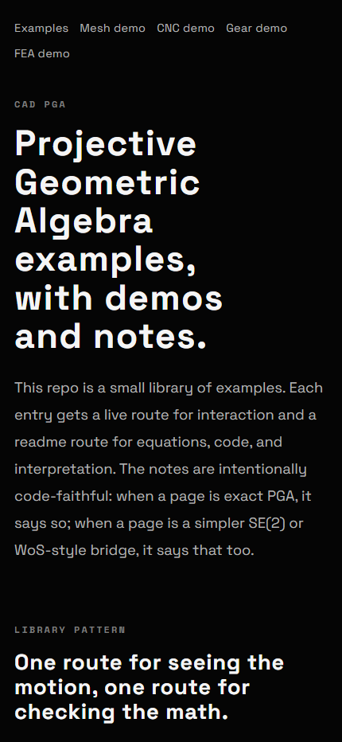
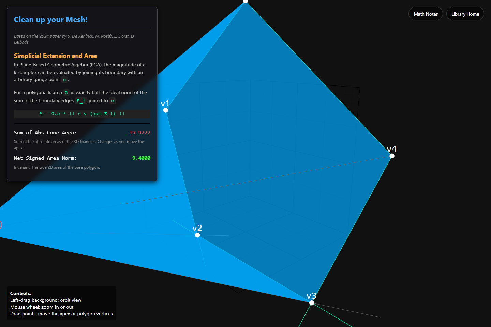
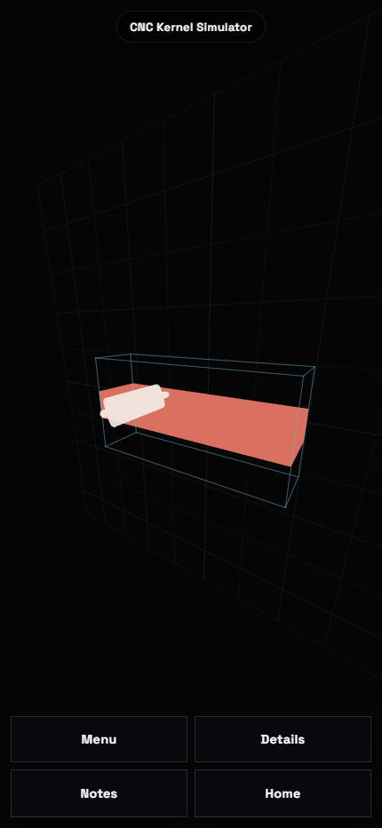
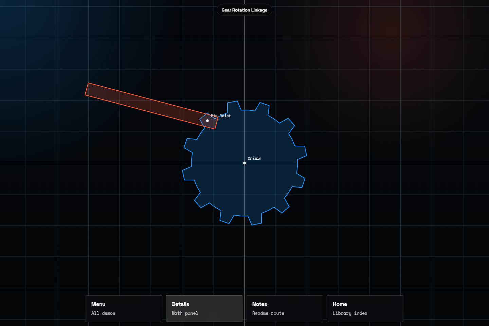
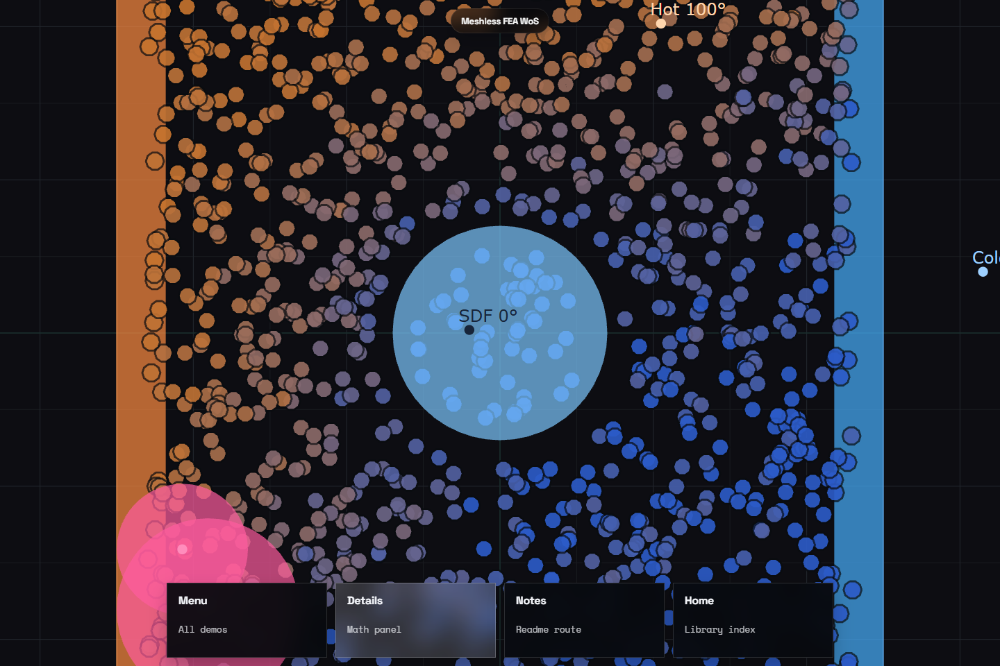
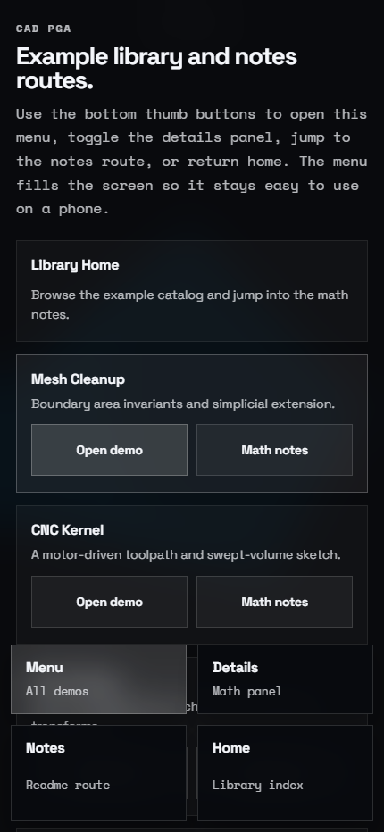

# cad-pga

Static Vite site for a growing library of PGA / ganja.js demos with MathJax companion notes.

## Live Pages

- [Library home](https://timcash.github.io/cad-pga/)
- [Codex terminal page](https://timcash.github.io/cad-pga/codex/)
- [Legion WebSocket tunnel demo](https://timcash.github.io/cad-pga/legion/)
- [Area from Boundary demo](https://timcash.github.io/cad-pga/mesh-cleanup/) and [notes](https://timcash.github.io/cad-pga/mesh-cleanup/readme/)
- [CNC Tool Motion demo](https://timcash.github.io/cad-pga/cnc-kernel-simulator/) and [notes](https://timcash.github.io/cad-pga/cnc-kernel-simulator/readme/)
- [Gear Hierarchy demo](https://timcash.github.io/cad-pga/gear-rotation-linkage/) and [notes](https://timcash.github.io/cad-pga/gear-rotation-linkage/readme/)
- [Heat by Sphere Walks demo](https://timcash.github.io/cad-pga/meshless-fea-wos/) and [notes](https://timcash.github.io/cad-pga/meshless-fea-wos/readme/)

## Recent Screenshots

| Library Home | Area from Boundary | CNC Tool Motion |
| --- | --- | --- |
|  |  |  |
| Gear Hierarchy | Heat by Sphere Walks | Mobile Menu |
|  |  |  |

The screenshots at the top of this README are refreshed by `npm run test:ui`.

## Docs

- Verified bibliography and source review: [docs/OUTLINE.md](docs/OUTLINE.md)
- The per-demo `readme/` pages aim to keep the MathJax examples aligned with the code, including notes where a page is PGA-inspired rather than a literal ganja.js implementation.

## PWA Features

- Installable standalone app manifest
- Apple touch icon and Android app icons
- Maskable icons for launcher support
- Local service worker for app shell caching
- Vendored `ganja.js` so the installed app does not depend on a CDN fetch
- Bundled MathJax via npm so the notes render from the built site assets

## Codex Route

- `/codex/` is a browser-hosted `xterm.js` client for the local Codex CLI.
- The static page is built into GitHub Pages, but it becomes interactive only when the local bridge daemon is running.
- The bridge requires `CODEX_BRIDGE_PASSWORD` to be set locally and unlocks a browser session for 10 minutes.
- The bridge is designed to sit behind `https://codex.dialtone.earth` through a local Cloudflare Tunnel.
- The page now has three bridge modes:
  - `Auto` picks localhost during local dev and the tunnel route on GitHub Pages.
  - `Dev` uses the current page origin so `http://localhost:5174/codex/` can talk through the Vite proxy.
  - `Bridge` targets the direct bridge endpoint, which defaults to `http://127.0.0.1:4186` on localhost and `https://codex.dialtone.earth` on GitHub Pages.

Before starting the bridge, create an untracked local env file:

```bash
cp .env.local.example .env.local
```

Then set your own password in `.env.local`:

```bash
CODEX_BRIDGE_PASSWORD=choose-a-strong-local-password
```

Useful commands:

```bash
npm install
npm run dev
npm run codex:bridge
npm run codex:daemon:start -- --tunnel
npm run codex:daemon:status
npm run codex:daemon:stop
```

Tunnel-related env vars:

- `CODEX_PUBLIC_ORIGIN`
- `CODEX_BRIDGE_PASSWORD`
- `CODEX_TUNNEL_TOKEN`
- `CF_TUNNEL_TOKEN_CODEX`
- `CF_TUNNEL_TOKEN`
- `CODEX_CLOUDFLARED_BIN`

## Legion WebSocket Demo

- `/legion/` is a static WebSocket client that proves GitHub Pages can talk to this computer through `wss://legion.dialtone.earth/ws-lab`.
- The local target is a small echo server on `http://127.0.0.1:4196`.
- The server only accepts expected origins, including `https://timcash.github.io` and local Vite dev origins.
- The page has three modes:
  - `Auto` uses the localhost proxy during dev and the public tunnel on GitHub Pages.
  - `Dev` uses the current page origin and the Vite proxy.
  - `Legion` always targets `https://legion.dialtone.earth`.

Useful commands:

```bash
npm run legion:dev
npm run legion:server
npm run legion:daemon:start
npm run legion:daemon:start -- --tunnel
npm run legion:daemon:status
npm run legion:tunnel:provision
npm run legion:tunnel:start
```

Planning notes for the tunnel flow live in [LEGION_WS_PLAN.md](LEGION_WS_PLAN.md).

## What Came Over From `guitar-tabs`

This repo keeps the parts of the `guitar-tabs` setup that are useful for a static demo site:

- Vite serves and builds the app from the root `index.html`.
- Vite is configured as a multi-page app so each example gets its own GitHub Pages path.
- Each example can also have a companion `readme/` route with bundled MathJax notes.
- `vite.config.js` reads `VITE_SITE_BASE_PATH` so the site can build for a GitHub Pages subpath.
- `scripts/build-pages.mjs` runs the build, copies `dist/index.html` to `dist/404.html`, and writes `.nojekyll`.
- `.github/workflows/deploy-pages.yml` publishes `dist/` to GitHub Pages on pushes to `main`.
- `public/demo-shell.css` and `public/demo-runtime.js` provide the responsive `Menu` and `Details` overlays shared by the live demos.

Unlike `guitar-tabs`, this repo is still mostly a static demo gallery, but it now also includes an optional local Codex bridge daemon for the `/codex/` route alongside the TypeScript + Puppeteer UI capture flow for the README screenshots.

## Local Dev

```bash
npm install
npm run dev
```

To refresh the screenshot grid in this README:

```bash
npm run test:ui
```

## Production Build

```bash
npm run build
```

## GitHub Pages Build

```bash
npm run build:pages
```

The Pages helper automatically uses `/<repo-name>/` as the default base path when `GITHUB_REPOSITORY` is present.
